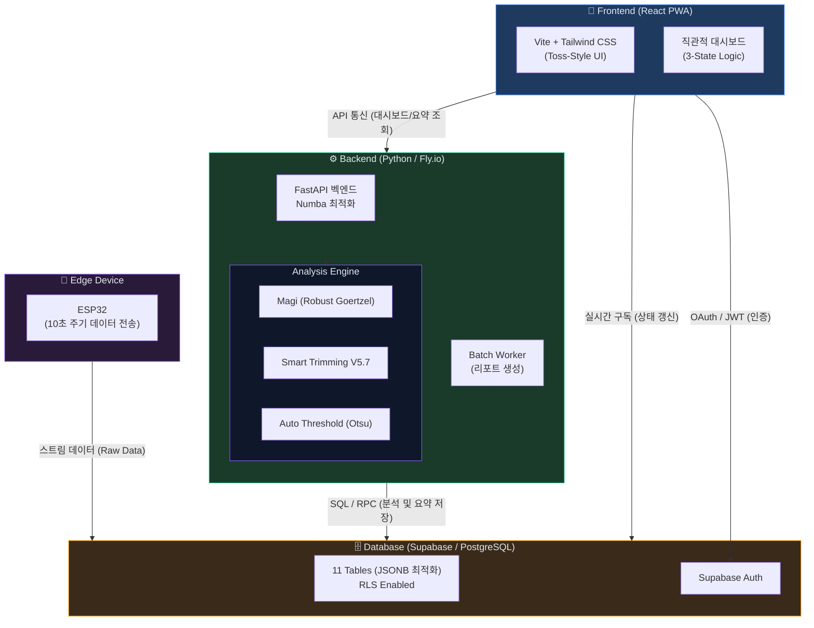
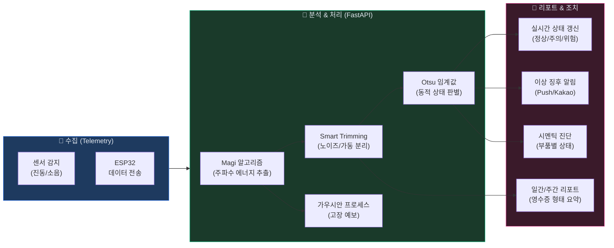
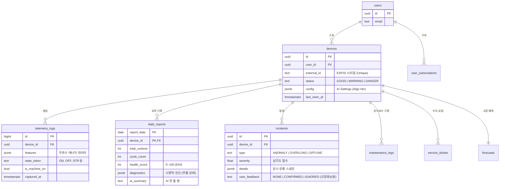
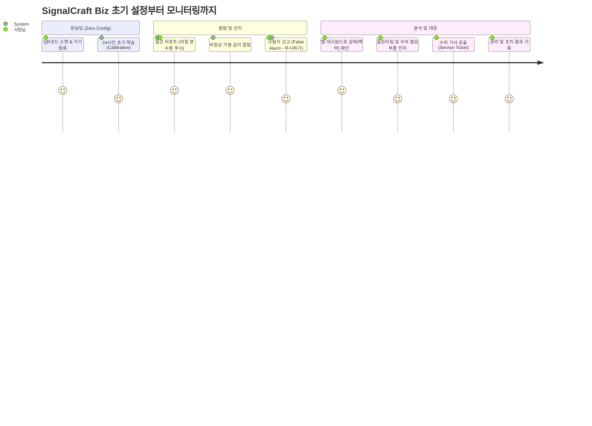
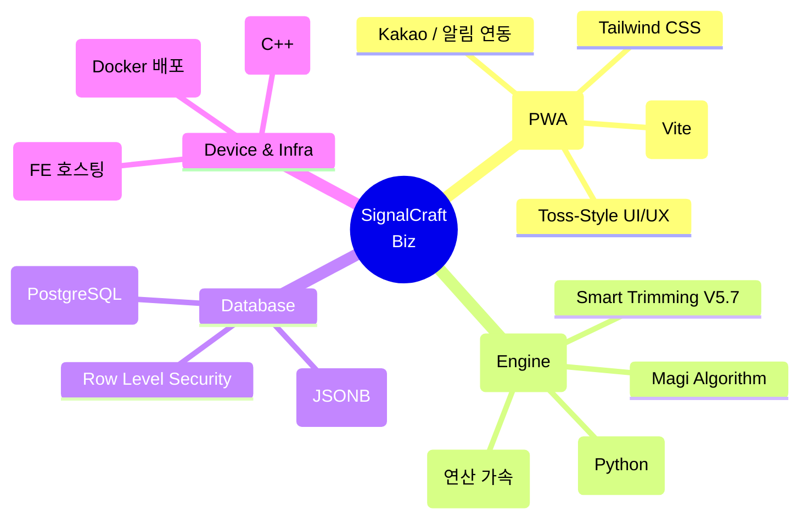

# SignalCraft Biz — 무설정 AI 시설 관리 솔루션

> **"전원만 켜면 AI가 스스로 알아서 모니터링하고 보고합니다."**  
> 무인 매장(아이스크림 할인점 등), 소규모 공장 관리자를 위한 직관적이고 자동화된 통합 상태 모니터링 및 예지 보전 시스템(Web PWA)입니다.

---

## 1. 시스템 아키텍처

---

## 2. 데이터 흐름 (주요 파이프라인)

---

## 3. ERD (데이터베이스 관계도)

---

## 4. 사용자 여정 (User Journey)

---

## 5. 핵심 가치 및 주요 기능 (Core Features)

### 🚀 1. Zero Config (무설정)
- **쉬운 등록**: 기기에 전원만 켜고 QR코드를 찍으면 즉시 앱과 연동됩니다. (ESP32 -> Supabase 동기화)
- **자가 학습**: 첫 24시간 동안은 알림 없이 기계의 평상시 소음(Noise Floor)과 가동 진동 패턴을 파악하여 **기준점(Baseline)**을 설정합니다.

### 📊 2. AI 리포트 (Auto-Report)
- **매일 아침 자동 브리핑**: "어제 총 14시간 가동, 2회 과부하"와 같이, 복잡한 그래프 대신 하루의 성과와 안심도를 영수증처럼 출력하여 푸시 발송.
- **가상 센서 리포트 (Virtual ROI)**: 진동/소음 센서만으로 전력 소모(180Hz), 문 열림(배경 소음), 제상 효율을 뽑아내어 간접적/경제적 이득을 산출합니다.

### 💡 3. 인간 중심의 직관성 (Human-Centric UX)
- **Toss Style 대화형 인터페이스**: 기술적 단어 대신 "맥박(Pulse)", "고장까지 남은 골든타임", "~하고 있어요" 등 친근한 언어를 사용하여 심리적 허들을 없앱니다.
- **3-State Logic**: 수많은 데이터를 단순 분류하여 🟢 `정상 (Good)`, 🟡 `주의 (Warning)`, 🔴 `위험 (Danger)`으로 대시보드에서 1초 만에 파악 가능하도록 제공합니다.

### 🛠️ 4. 정밀 진단 및 피드백 루프 (Predictive Maintenance)
- **오탐지 튜닝**: "무시하기" 동작 수행 시 해당 피처를 False Positive로 학습하여 Otsu 민감도 파라미터를 자동 완화.
- **고장 예보 엔진 (72H Forecast)**: 가우시안 프로세스를 통한 고장 도달 확률 계산 및 부품(컴프레서/팬/밸브)에 대한 개별 시멘틱(원인) 분석 제공.

---

## 6. 기술 스택 요약 (Tech Specs)

---

## 7. 업데이트 로드맵 (Milestones)

| Phase | Milestone | 상태 | 핵심 내용 |
| --- | --- | --- | --- |
| **Phase 1** | Backend Core | `완료` | FastAPI 구축, V5.7 엔진, Supabase 연결 완료 |
| **Phase 2** | Reporting Engine | `완료` | 배치 작업 스케줄링(일일 리포트), 트리거 알림 개발 |
| **Phase 3** | Frontend MVP | `완료` | React PWA 인터페이스 시안, FCM 알림 등록 |
| **Phase 4** | Test & Tuning | `완료` | 실환경 테스트 및 동적 Otsu 임계값, 학습 모드 조정 |
| **Phase 5** | Advanced UX | `완료` | 다크 모드, Toss 톤앤매너 텍스트 최적화 적용 |
| **Phase 6** | Notifications | `진행 중` | 카카오 알림 및 상세 설정(무시하기 피드백 포함) 고도화 확장 |
