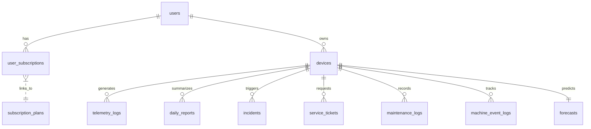

# SignalCraft Biz Database Schema (Final V2)

SignalCraft Biz의 핵심 가치인 **"Zero Config"**, **"Actionable Insight"**, **"Scalability"**를 지원하기 위한 확장형 Supabase(PostgreSQL) 스키마입니다.

## 1. 설계 원칙 (Design Principles)

1.  **Flexibility (유연성)**: `JSONB` 컬럼을 적극 활용하여 다양한 센서 데이터, AI 모델 버전(V5.7, V6.0), 동적 임계값을 DB 구조 변경 없이 수용합니다.
2.  **Performance (성능)**: 대량의 시계열 로그(`telemetry_logs`) 조회 속도를 위해 `TimeScaleDB` 스타일의 인덱싱과 `GIN Index`를 적용했습니다.
3.  **Actionable (실행 중심)**: 단순 감시를 넘어 '수리 기사 호출(`service_tickets`)' 및 '유지보수 기록(`maintenance_logs`)'을 통해 실제 문제 해결을 지원합니다.
4.  **Security (보안)**: Supabase RLS(Row Level Security)를 염두에 두고 모든 테이블은 `user_id` 또는 `organization_id` 기반의 소유권 검증 구조를 가집니다.

---

## 2. ER Diagram Overview



---

## 3. Tables Specification

### 1️⃣ Identity & Subscription (계정 및 구독)

#### `subscription_plans`
구독 등급별 기능 제한을 정의합니다. 하드코딩된 로직을 DB로 옮겨 운영 유연성을 확보합니다.

| Column | Type | Description | Note |
| :--- | :--- | :--- | :--- |
| `id` | `text` (PK) | 플랜 ID (예: 'free', 'pro', 'enterprise') | |
| `name` | `text` | 플랜 표시 이름 (예: "Basic Plan") | |
| `max_devices` | `int` | 등록 가능한 최대 기기 수 | Free: 1, Pro: 无限 |
| `data_retention_days` | `int` | 데이터 보관 기간 (일) | Free: 7, Pro: 30 |
| `allow_advanced_ai` | `bool` | 고급 AI 분석(예지보전) 사용 가능 여부 | |
| `price_krw` | `int` | 월 구독료 (원) | |

#### `user_subscriptions`
사용자의 구독 상태를 관리합니다.

| Column | Type | Description | Note |
| :--- | :--- | :--- | :--- |
| `user_id` | `uuid` (PK, FK) | `auth.users` 참조 | 1:1 관계 |
| `plan_id` | `text` (FK) | `subscription_plans.id` 참조 | |
| `status` | `text` | 'ACTIVE', 'EXPIRED', 'CANCELED' | |
| `expires_at` | `timestamptz` | 구독 만료 예정일 | |
| `is_auto_renew` | `bool` | 자동 갱신 여부 | |

---

### 2️⃣ Device Management (설비 관리)

#### `devices`
기기의 상태와 동적 AI 설정을 관리합니다. JSONB를 통해 "버전별 설정값"을 유연하게 저장합니다.

| Column | Type | Description | Note |
| :--- | :--- | :--- | :--- |
| `id` | `uuid` (PK) | 기기 고유 ID | `gen_random_uuid()` |
| `user_id` | `uuid` (FK) | 소유주 ID (`auth.users`) | RLS 기준 (Indexing 필수) |
| `external_id` | `text` | ESP32 하드웨어 시리얼 넘버 | Unique Index 필수 |
| `name` | `text` | 사용자 지정 별칭 | 예: "워크인 냉동고" |
| `model_type` | `text` | 설비 유형 | 'FREEZER', 'HVAC' 등 |
| `status` | `text` | 현재 상태 (UI 표시용) | 'GOOD', 'WARNING', 'DANGER' |
| `config` | `jsonb` | **[핵심] AI 및 기기 설정값** | 예: `{"algo_ver": "5.7", "thresholds": {"60hz": 1.2}}` |
| `location_info` | `jsonb` | 지리 정보 (Multi-site용) | 예: `{"lat": 37.5, "lng": 127.0, "address": "..."}` |
| `last_seen_at` | `timestamptz` | 마지막 통신 시각 | 오프라인 감지용 |
| `created_at` | `timestamptz` | 등록일 | |

*   **Indexes**: `idx_devices_user_id`, `idx_devices_external_id` (Unique), `idx_devices_config` (GIN)

---

### 3️⃣ Telemetry & Logs (데이터 수집)

#### `telemetry_logs`
SoundLab의 노하우를 담아 10초마다 들어오는 센서 데이터를 저장합니다. 구조가 바뀌어도 스키마 변경이 필요 없도록 JSONB를 사용합니다.

| Column | Type | Description | Note |
| :--- | :--- | :--- | :--- |
| `id` | `bigint` (PK) | 자동 증가 ID | 대용량 데이터 최적화 (Partitioning 고려) |
| `device_id` | `uuid` (FK) | 기기 ID | `ON DELETE CASCADE` |
| `features` | `jsonb` | **[핵심] 주파수별 특징 데이터** | 예: `{"60hz": 0.5, "120hz": 0.2, "temp": -18}` |
| `state_token` | `text` | 가동 모드 [ON, OFF, STR, UNL, DEF] | Pulse Status용 |
| `is_machine_on` | `bool` | 가동 여부 (SoundLab 알고리즘 결과) | 리포트 통계용 |
| `captured_at` | `timestamptz` | 데이터 수집 시각 | |

*   **Indexes**: `idx_telemetry_device_time` (복합: device_id + captured_at DESC), `idx_telemetry_features` (GIN)

#### `incidents` (이상 징후)
임계값 초과 등 이벤트가 발생했을 때만 기록됩니다.

| Column | Type | Description | Note |
| :--- | :--- | :--- | :--- |
| `id` | `uuid` (PK) | 이벤트 ID | |
| `device_id` | `uuid` (FK) | 기기 ID | |
| `type` | `text` | 'ANOMALY', 'OVERLOAD', 'OFFLINE' | |
| `severity` | `float` | 심각도 점수 (0.0 ~ 1.0) | |
| `details` | `jsonb` | 당시 상황 스냅샷 | 예: `{"rms": 2.5, "threshold": 1.0}` |
| `user_feedback`| `text` | 사용자 피드백 (오탐 신고) | 'NONE', 'CONFIRMED', 'IGNORED' |
| `created_at` | `timestamptz` | 발생 시각 | |

---

### 4️⃣ Reporting & Maintenance (분석 및 조치)

#### `daily_reports`
매일 밤 생성되는 영수증 형태의 요약 리포트입니다.

| Column | Type | Description | Note |
| :--- | :--- | :--- | :--- |
| `report_date` | `date` (PK) | 리포트 날짜 (YYYY-MM-DD) | 복합 PK (date + device_id) |
| `device_id` | `uuid` (PK) | 기기 ID | 복합 PK |
| `total_runtime`| `int` | 총 가동 시간 (초) | |
| `cycle_count` | `int` | ON/OFF 횟수 | |
| `health_score` | `int` | 일간 건강 점수 (EHI: 0-100) | |
| `roi_data` | `jsonb` | **[Virtual ROI] 경제적 가치** | 예: `{"watt": 45.2, "door_opens": 12}` |
| `diagnostics` | `jsonb` | **[핵심] 부품별 시멘틱 분석** | 예: `{"comp": 95, "fan": 88, "valve": 92}` |
| `ai_summary` | `text` | AI 한 줄 평 (Reasoning Log) | |
| `haccp_status` | `text` | HACCP 준수 여부 (PASS/FAIL) | |
| `created_at` | `timestamptz` | 생성 시각 | |

#### `maintenance_logs` (유지보수 이력)
사용자가 직접 수행한 관리 이력을 기록합니다. AI 예지 보전의 강력한 근거 데이터가 됩니다.

| Column | Type | Description | Note |
| :--- | :--- | :--- | :--- |
| `id` | `uuid` (PK) | 로그 ID | |
| `device_id` | `uuid` (FK) | 기기 ID | |
| `action_type` | `text` | 'CLEANING' (청소), 'CHECK' (점검), 'PART_REPLACE' (부품교체) | |
| `description` | `text` | 상세 내용 (사용자 입력) | 예: "먼지 필터 물세척함" |
| `performed_at` | `timestamptz` | 수행 일시 | |
| `images` | `text[]` | 증빙 사진 URL 배열 (옵션) | |

#### `service_tickets` (수리 요청)
심각한 문제 발생 시 앱 내에서 수리 기사를 호출하고 관리하는 티켓입니다.

| Column | Type | Description | Note |
| :--- | :--- | :--- | :--- |
| `id` | `uuid` (PK) | 티켓 ID | |
| `device_id` | `uuid` (FK) | 고장 난 기기 ID | |
| `user_id` | `uuid` (FK) | 요청자 ID | |
| `issue_type` | `text` | 'NOISE', 'NOT_COOLING', 'POWER' | |
| `status` | `text` | 상태 | 'OPEN', 'ASSIGNED', 'RESOLVED' |
| `technician_info`| `jsonb` | 배정된 기사 정보 | 예: `{"name": "김기사", "phone": "010-..."}` |
| `scheduled_at` | `timestamptz` | 방문 예정 시간 | |
| `resolved_at` | `timestamptz` | 해결 완료 시간 | |

### 5️⃣ Advanced Analytics (고급 분석)

#### `machine_event_logs` (1분 단위 정밀 로그)
HACCP 법적 증빙을 위한 상세 이벤트 타임라인입니다.

| Column | Type | Description | Note |
| :--- | :--- | :--- | :--- |
| `id` | `uuid` (PK) | | |
| `device_id` | `uuid` (FK) | | |
| `event_type` | `text` | 'ON', 'OFF', 'DEF', 'DOOR' | |
| `status` | `text` | '정상', '주의', '절전' | |
| `details` | `text` | 비고 (예: "15분 가동 완료") | |
| `occurred_at` | `timestamptz` | 발생 시각 | |

#### `forecasts` (고장 예보 엔진)
가우시안 프로세스(GP) 기반의 미래 예측 데이터입니다.

| Column | Type | Description | Note |
| :--- | :--- | :--- | :--- |
| `device_id` | `uuid` (PK, FK) | | One-to-One with devices |
| `prediction_data` | `jsonb` | 미래 3일간의 Mean/Uncertainty 배열 | |
| `golden_time` | `timestamptz` | 고장 임계치 도달 예상 시점 | 카운트다운용 |
| `updated_at` | `timestamptz` | 모델 갱신 시각 | |

---

## 4. Initialization SQL

Supabase SQL Editor에서 실행하여 테이블을 생성할 수 있습니다.

```sql
-- Enable Extensions
create extension if not exists "uuid-ossp";

-- 1. Devices & Config
create table public.devices (
  id uuid default gen_random_uuid() primary key,
  user_id uuid references auth.users(id) not null,
  external_id text, -- unique index below
  name text not null,
  model_type text,
  status text default 'GOOD',
  config jsonb default '{"algo_ver": "5.7"}'::jsonb,
  location_info jsonb,
  last_seen_at timestamptz,
  created_at timestamptz default now()
);
create unique index idx_devices_external_id on public.devices (external_id);
create index idx_devices_user_id on public.devices (user_id);

-- 2. Telemetry (TimeSeries)
create table public.telemetry_logs (
  id bigint generated by default as identity primary key,
  device_id uuid references public.devices(id) on delete cascade,
  features jsonb not null, 
  state_token text,
  is_machine_on boolean default false,
  captured_at timestamptz default now()
);
create index idx_telemetry_device_time on public.telemetry_logs (device_id, captured_at desc);

-- 3. Daily Reports (Aggregation)
create table public.daily_reports (
  report_date date not null,
  device_id uuid references public.devices(id) on delete cascade,
  total_runtime int default 0,
  cycle_count int default 0,
  health_score int default 100,
  roi_data jsonb,
  diagnostics jsonb,
  ai_summary text,
  haccp_status text default 'PASS',
  created_at timestamptz default now(),
  primary key (report_date, device_id)
);

-- 4. Incidents
create table public.incidents (
  id uuid default gen_random_uuid() primary key,
  device_id uuid references public.devices(id) on delete cascade,
  type text not null,
  severity float default 0.0,
  details jsonb,
  user_feedback text default 'NONE',
  created_at timestamptz default now()
);

-- 5. Maintenance
create table public.maintenance_logs (
  id uuid default gen_random_uuid() primary key,
  device_id uuid references public.devices(id) on delete cascade,
  action_type text not null,
  description text,
  performed_at timestamptz default now(),
  images text[]
);
```
